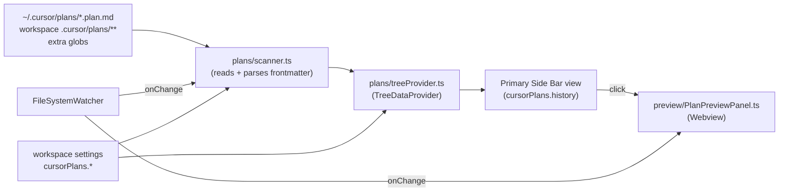

## Goal

Build a TypeScript VS Code extension, `cursor-plans-history`, that:

- Adds a custom icon to the primary side bar (Activity Bar).
- Shows a tree of all plan files (`.plan.md`) grouped by source: **Global** (`~/.cursor/plans/`), **Workspace** (`.cursor/plans/**`), **Extra globs** (user-configurable).
- Click a plan -> opens a webview preview that renders the same shape Cursor uses (title, overview, todos with status pills, markdown body).
- Live-refreshes on FS changes (watcher).
- Ships i18n (English default + Spanish via `vscode.l10n` + `package.nls.*.json`).
- Is publishable to both VS Code Marketplace (`vsce`) and Open VSX / Cursor (`ovsx`) from a single codebase via tag-based GitHub Actions.

Compatible with VS Code `^1.85.0` and Cursor (any recent build).

## Why this design

- Cursor stores plans at `~/.cursor/plans/*.plan.md` with YAML frontmatter (`name`, `overview`, `todos[].{id,content,status}`, `isProject`). We parse that frontmatter to render exactly what the user sees when a plan is generated.
- Single codebase ships to both marketplaces because Cursor's extension store mirrors Open VSX. Same `.vsix`.
- Webview (not custom editor by default) keeps "open the markdown file" UX intact and avoids fighting other markdown extensions. Custom editor is offered as opt-in via setting.

## Architecture



## Project layout

```
package.json
package.nls.json
package.nls.es.json
tsconfig.json
esbuild.js
.eslintrc.cjs / .prettierrc.json / .vscodeignore / .gitignore
README.md  CHANGELOG.md  LICENSE
icon.png                    # 128x128 marketplace icon
media/
  sidebar-icon.svg          # monochrome activity bar icon
  preview.css  preview.js
l10n/
  bundle.l10n.json          # source (en)
  bundle.l10n.es.json       # spanish
src/
  extension.ts
  config.ts
  plans/{scanner,treeProvider,treeItems,types}.ts
  preview/{PlanPreviewPanel,renderer}.ts
  util/{paths,time,fs}.ts
  commands.ts
  fileWatcher.ts
  test/...
.github/workflows/{ci.yml,release.yml}
```

## Key contributions in `package.json`

- `viewsContainers.activitybar`: id `cursorPlans` with `media/sidebar-icon.svg`.
- `views.cursorPlans`: tree view `cursorPlans.history`, with `welcome` content for empty state.
- `viewsWelcome`: prompt to configure folder/globs if no plans found.
- Commands:
  - `cursorPlans.openPreview` (default click), `cursorPlans.openSource`,
  - `cursorPlans.refresh`, `cursorPlans.search` (quick pick),
  - `cursorPlans.revealInOS`, `cursorPlans.copyPath`,
  - `cursorPlans.rename`, `cursorPlans.delete` (confirm),
  - `cursorPlans.configure`.
- Menus: `view/title` (refresh, search, configure), `view/item/context` (open source, copy path, reveal, rename, delete).
- Configuration (`cursorPlans.*`):
  - `globalPlansDir` (string, default `~/.cursor/plans`)
  - `includeWorkspace` (boolean, default `true`)
  - `workspaceGlobs` (string[], default `[".cursor/plans/**/*.plan.md"]`)
  - `extraGlobs` (string[], default `[]`) — any custom `.md` patterns.
  - `groupBy` (`source` | `date` | `none`, default `source`)
  - `sortBy` (`modified-desc` | `modified-asc` | `name`, default `modified-desc`)
  - `useCustomEditor` (boolean, default `false`) — when `true` also registers a `customEditor` so opening `*.plan.md` from Explorer shows the rendered view.
  - `confirmDelete` (boolean, default `true`)
- `l10n: "./l10n"` for runtime strings.
- `activationEvents`: lazy via `onView:cursorPlans.history` (manifest v3 style).

## Plan data model & parser

`src/plans/types.ts`:

```ts
export type PlanStatus = "pending" | "in-progress" | "completed" | "error";
export interface PlanTodo { id: string; content: string; status: PlanStatus }
export interface Plan {
  uri: vscode.Uri;
  source: "global" | "workspace" | "extra";
  name: string;          // frontmatter.name || basename
  overview?: string;
  todos: PlanTodo[];
  isProject: boolean;
  body: string;          // markdown after frontmatter
  mtime: number;
}
```

`src/plans/scanner.ts`:

- Resolves `~` via `os.homedir()`.
- For global dir uses `fs/promises.readdir` (no `findFiles` because it's outside any workspace folder).
- For workspace globs uses `vscode.workspace.findFiles(glob, null)` per workspace folder.
- Parses frontmatter with `gray-matter` (small, robust). On parse error, gracefully falls back to filename + empty todos and logs to output channel.
- Caches results in-memory; invalidated by the watcher.

## Tree view

`src/plans/treeProvider.ts`:

- Root nodes per group (when `groupBy=source`): Global / Workspace / Extra. With counts.
- Plan nodes:
  - `label` = `plan.name`.
  - `description` = `${completed}/${total} - ${relativeDate(mtime)}`.
  - `tooltip` = `new vscode.MarkdownString` with overview + first 3 todos.
  - `iconPath` = `ThemeIcon` based on progress (`checklist` default, `pass` if all completed, `warning` if any `error`).
  - `resourceUri` = file URI (enables Explorer integration & file decorations).
  - `command` = `cursorPlans.openPreview` with the plan id.
- Welcome view when zero plans found, with buttons to set `globalPlansDir` and add globs.

## Webview preview

`src/preview/PlanPreviewPanel.ts`:

- Singleton-ish per plan URI (`Map<string, WebviewPanel>`).
- Strict CSP with per-load `nonce`, only `webview.cspSource` resources allowed, no inline scripts except via `nonce`.
- `WebviewPanelSerializer` registered so panels survive reloads.
- HTML structure:
  - Header: `name` + `Project` badge if `isProject` + progress bar (`completed/total`).
  - Sub-header: `overview`.
  - Todos list: status icon (codicon) + content; statuses styled via `--vscode-*` colors:
    - `completed` -> `--vscode-testing-iconPassed`
    - `in-progress` -> `--vscode-progressBar-background`
    - `error` -> `--vscode-testing-iconFailed`
    - `pending` -> muted foreground
  - Body: markdown rendered with `markdown-it` + `markdown-it-task-lists` + `highlight.js` (loaded as webview-uri resources, no CDN).
  - Toolbar buttons: Open Source, Reveal in Explorer, Copy Markdown.
- Listens to file change events for its URI and re-renders.

## File watching

`src/fileWatcher.ts`:

- `vscode.workspace.createFileSystemWatcher` per workspace glob.
- For the global folder (outside workspace) uses `fs.watch` with `recursive: true` fallback to polling on Windows.
- Debounced (200 ms) calls into `scanner.invalidate()` then fires `treeProvider._onDidChangeTreeData`.

## i18n

- `package.nls.json` / `package.nls.es.json`: declarative strings (`%cursorPlans.view.title%`, command titles, config descriptions).
- `l10n/bundle.l10n.json` / `bundle.l10n.es.json`: runtime strings via `vscode.l10n.t("...")`.
- All user-visible text routed through one of these two mechanisms — no hardcoded English in code.

## Build & tooling

- `esbuild` bundles `src/extension.ts` -> `dist/extension.cjs` (`platform=node`, `external: ['vscode']`, `minify` in prod, `sourcemap`).
- TypeScript `strict`, target ES2022, `module: Node16`.
- ESLint (`@typescript-eslint`) + Prettier.
- Tests with `@vscode/test-cli` + Mocha: unit tests for `scanner.ts` (frontmatter edge cases) and integration test that opens the view and asserts a tree item exists for a fixture plan.

## Marketplace readiness

- `engines.vscode: ^1.85.0`, `categories: ["Other","Visualization"]`, `keywords: ["cursor","plan","plan mode","todo","markdown"]`.
- `repository`, `bugs`, `homepage`, `license: MIT`, `icon: icon.png`.
- `README.md`: features, screenshots placeholders, install (VS Code + Cursor sections), settings table, i18n note.
- `CHANGELOG.md` with `0.1.0` initial entry.
- `.vscodeignore` strips `src/`, tests, configs, screenshots sources.
- `LICENSE` MIT.

## CI / publishing

`.github/workflows/ci.yml`: install, lint, build, test (headless via `xvfb-run` on Linux).

`.github/workflows/release.yml` on tag `v*`:

1. Build + test.
2. `npx @vscode/vsce package` -> `cursor-plans-history-${version}.vsix`.
3. `npx @vscode/vsce publish -p ${{ secrets.VSCE_PAT }}` (VS Code Marketplace).
4. `npx ovsx publish *.vsix -p ${{ secrets.OVSX_PAT }}` (Open VSX -> shown in Cursor).
5. Attach `.vsix` to the GitHub release.

Secrets to set after the code lands: `VSCE_PAT` (Azure DevOps PAT for VS Code publisher), `OVSX_PAT` (Eclipse Open VSX token).

## Out of scope (can be follow-ups)

- Editing plans / toggling todo status from the webview (would need to write back YAML).
- Diff view between plan versions.
- Search across plan bodies (only filename/name search in v0.1).